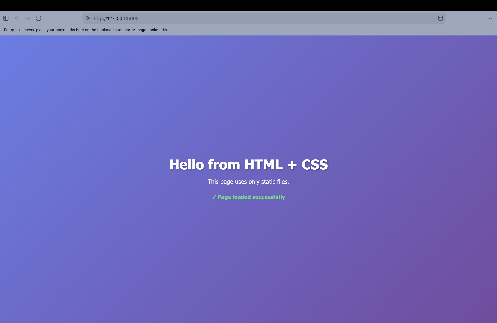

## CI/CD Pipeline

Inside this repository contains my thought process and understanding of how CI/CD can be used in the Cloud Networking and  I'll be completing Two Assignments which Test my Understanding through the use of GitHub Actions


## What is CI/CD

CI/CD is an acronym for Continuous Integration and Continuous Deployment/Delivery. It's a set of practices and tools used by development teams to automate testing, integration, and deployment of code changes—reducing manual effort, accelerating feedback loops, and enabling smooth, reliable releases from development through staging, testing, and production environments.


## Assignments

Inside the Assignments Folders, contains two tasks which are used to test my understanding of how to write YAML Syntax and learning how to script

* The first Tasks contains being able to build a simple CI pipeline that runs tests or checks automatically on each push
  
* The second tasks is CD workflow that deploys an application or updates an enivornment automatically 


<div align="right">
  
</div>


## Prerequisites 
- Python, Preferably the latest version Installed with Venv Environment
- Docker Containerization Installed


## How to Run Locally

 - 1.   First Clone the Repository

``` bash
First Clone the Repository
https://github.com/SaeedAAli/CICD.git
```


 - 2.   Docker Build the Image

``` bash
Docker Build the Image inside the Repository note (To simplify, build the Image inside each Task folder and not do it outside the root)
docker build -t <Your Name> .
```


 - 3.   Run the Container

``` bash
Docker Build the Image inside the Repository note (To simplify, build the Image inside each Task folder and not do it outside the root)
Docker run -p 5002:5002 --name <Container Name> <Image Name You've just built> :latest
```

 - 3.   See Results

``` bash
    Port to this Address on your Browser  http://localhost:5002/
```

 -4. Voila


## Tech Stack used

- HTML
- CSS
- Python
- Docker
